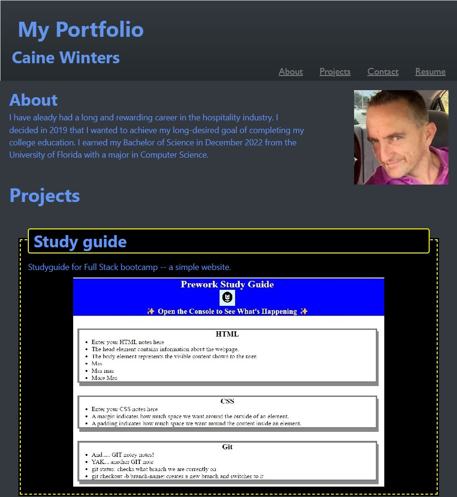

# My portfolio:  Caine Winters

## This is a portfolio and summary-bio of my work to date.

The layout consists of:  
	-Header:  Title with links to sections throughout the document.  
	-About:  Profile picture and summary story.  
	-Projects:  Contains screenshots of projects that link (when possible) to the noted work.  
	-Footer:  Contact links.  
	
## Projects  
The Study Guide web app link will open a page that shows the actual application.
The others have links that are functional, but only open their GitHub repos.
They are not properly deployed, but for the purposes of this assignment/project,
where empty placeholders were expected for our very limited experience,
I believed this would suffice.

## Style  
The core structure of this website deployement is based on Activity 28
from Week 02 of this Bootcamp (also noted in the  `style.css` file).
With more time I am certain the polish and filling-out of this portfolio
would find greater realizations.  

N E E D    T O    C H A N G E    T H I S ! ! ! ! !!!!
## [Link to finished product](https://elcaine.github.io/Refactoring-Standardising-Wk1_Challenge/)

## Webpage resembles personalized spirit of the example provided.
